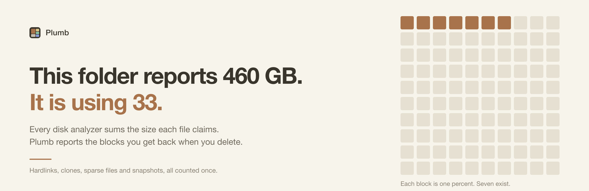
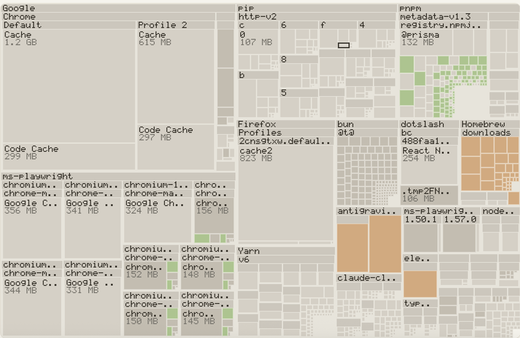
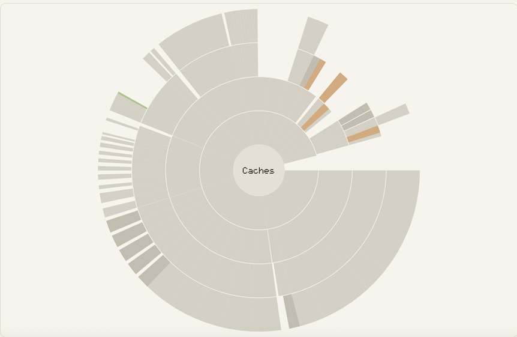
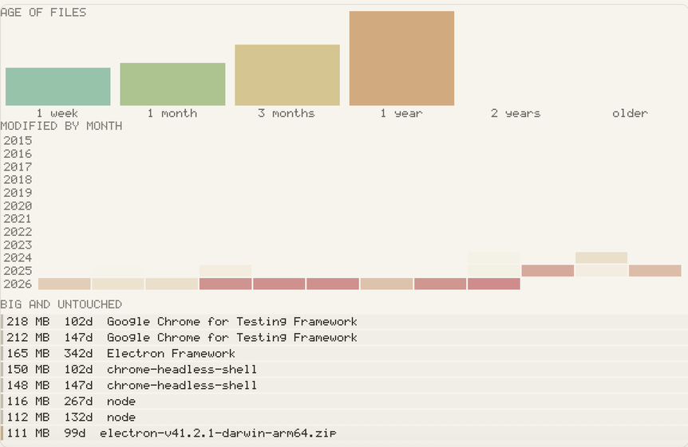

<h1 align="center">Plumb</h1>

<p align="center">
  See what deleting actually frees, not what merely looks big.
</p>

<p align="center">
  <a href="https://github.com/Karanjot786/Plumb/actions/workflows/ci.yml"></a>
  <a href="https://github.com/Karanjot786/Plumb/releases/latest"></a>
  <a href="LICENSE"></a>
  
</p>

<p align="center">
  
</p>

Every disk analyzer adds up the size each file claims. Filesystems stopped storing files
that way years ago. Plumb reports the blocks you get back when you delete something.

A real scan of a real folder:

```
~/Library/Containers
  logical      460.91 GB
  allocated    33.11 GB
  freeable     33.10 GB  <- what deleting actually frees
  contents     21441 files, 8022 folders
  scan time    1.087s
```

The folder reports 460 GB. The disk holds 33.

## Download

Version 0.1.0. Binaries are unsigned. Read the note below before your first launch.

| Platform | Desktop app | Command line |
| --- | --- | --- |
| macOS, Apple Silicon | [Plumb_0.1.0_aarch64.dmg](https://github.com/Karanjot786/Plumb/releases/download/v0.1.0/Plumb_0.1.0_aarch64.dmg) | [tar.gz](https://github.com/Karanjot786/Plumb/releases/download/v0.1.0/plumb-v0.1.0-macos-arm64.tar.gz) |
| macOS, Intel | [Plumb_0.1.0_x64.dmg](https://github.com/Karanjot786/Plumb/releases/download/v0.1.0/Plumb_0.1.0_x64.dmg) | [tar.gz](https://github.com/Karanjot786/Plumb/releases/download/v0.1.0/plumb-v0.1.0-macos-x86_64.tar.gz) |
| Linux, x86_64 | [.deb](https://github.com/Karanjot786/Plumb/releases/download/v0.1.0/Plumb_0.1.0_amd64.deb) or [.AppImage](https://github.com/Karanjot786/Plumb/releases/download/v0.1.0/Plumb_0.1.0_amd64.AppImage) | [tar.gz](https://github.com/Karanjot786/Plumb/releases/download/v0.1.0/plumb-v0.1.0-linux-x86_64.tar.gz) |
| Windows | build from source | build from source |

Every release lives on the [releases page](https://github.com/Karanjot786/Plumb/releases).

Plumb carries no Apple Developer signature. Notarization costs $99 a year and this project
has none. macOS blocks the first launch. Right-click the app, choose Open, then Open again
in the dialog. Once. For the command line tool, run
`xattr -d com.apple.quarantine ./plumb`. Building from source produces no quarantine flag
at all.

On Linux, install the deb with `sudo apt install ./Plumb_0.1.0_amd64.deb`. Apt resolves the
runtime libraries for you. The AppImage needs no install, only `chmod +x`.

## Why the two numbers disagree

Four mechanisms break the naive sum. All four are ordinary. You hit them without doing
anything unusual.

| Mechanism | What happens |
| --- | --- |
| Hardlinks | One file, several names. The filesystem stores the blocks once. Any tool summing each name counts them once per name. Delete one name and you free nothing. |
| Copy-on-write clones | On APFS, copying a file writes no data. The copy reports its full length and shares every block with the original until one side gets edited. Time Machine local snapshots use the same mechanism. |
| Sparse files | A container disk image advertises the size it might one day reach and occupies only what has been written. The 460 GB above comes from here. |
| Snapshots | Blocks a snapshot references outlive the file referencing them. You delete a file, watch it disappear, and see no change in free space until the snapshot expires. |

Plumb models all four on macOS, Linux and Windows. Shared blocks get credited once, at the
lowest common ancestor of everything sharing them, so a folder's number holds no matter
where you look from. Plumb reconciles the scan against the volume's real free space and
reports any remainder as unaccounted instead of absorbing it silently.

## The eight views

Plumb rasterizes all eight in Rust with `tiny-skia` and blits one image to the canvas
instead of drawing DOM or Canvas 2D primitives. A tree of a quarter million nodes stays
interactive, and the frontend behaves the same on WebKitGTK as on WKWebView.

<p align="center">
  
  
  
</p>

| View | Use |
| --- | --- |
| Treemap | The default. Squarified, so tiles stay near-square and comparable by area. |
| Folders | Plain nested rectangles, one level at a time, when the treemap reads too dense. |
| Sunburst | Radial. Depth reads as distance from the centre, so deep trees stay legible. |
| Flame | Icicle layout. Best for finding one deep expensive path. |
| Bubbles | Circle packing. Emphasises count and clustering over exact area. |
| Mind map | Radial tree. Shows structure rather than size. |
| Top sizes | A ranked list, scoped to here, to files anywhere, or to folders anywhere. |
| Age map | Coloured by last-modified age. Old and large is the strongest cleanup signal. |

Size every view by freeable bytes, the default, or by allocated or logical bytes.
Switching between them shows you the gap this project measures.

Alongside the views: a volume donut reconciling the scan against real free space, quick
wins, duplicate detection with optional reflink deduplication, snapshot save and diff, and
a Monitor reporting what grows under a directory as the growth happens.

## Safety

Plumb moves files. Read this section before running `clean`.

The design fits in one sentence. Nothing gets deleted except by `commit`, and everything
`commit` deletes appears in a manifest written to disk before the first file moves.

- `clean` stages. `clean` does not delete. Plumb renames selected paths into a private
  staging directory on the same volume, so the move stays atomic and costs no extra space.
  Without a same-volume staging directory, Plumb refuses the item. No fallback copies. No
  fallback deletes.
- The manifest lands first. A crash after the write leaves something `plumb restore`
  finishes. Each entry records the original path, the staged path, the size, and the
  `(dev, ino, mtime)` identity.
- Undo takes one command. `plumb restore <id>` returns everything. Restore never clobbers.
  If something now occupies the original path, the item stays staged and stays listed
  instead of overwriting your file.
- Deletion stays explicit and separate. `plumb commit <id>` is the only function in the
  project removing anything. The gate refusing paths outside staging runs in release
  builds, not as a debug assertion.
- Plumb re-checks identity immediately before every move. A file changed between
  inspection and staging gets skipped. Path strings would not survive a rename in the
  window. `(dev, ino, mtime)` does.
- A deny list guards the obvious catastrophes, matched by inode rather than by string, so a
  symlinked alias to `/System` gets caught too. Structural rules refuse any path lacking an
  absolute form, containing `.` or `..`, holding an empty component, sitting fewer than two
  levels from a volume root, equal to your home directory, or containing your home
  directory. A collapsed shell variable never turns `/Users/$USER/$LEAF` into `/Users`.
- Plumb never stages a mount point, moves symlinks as links without following them out of
  the tree, and refuses files a system package manager claims through `dpkg`, `rpm` or
  `pacman`.
- Uninstall shows guesses and never stages them. Plumb stages leftovers matched by bundle
  identifier. Matches made on an application name appear under "left alone", because two
  apps share a name and one of them is not the one you are removing. `--guesses` widens the
  display, never the action.

Staged items live 30 days by default. `plumb staged` lists every pending manifest.

## Known issues

Two defects sit in the staging gate. Both were reproduced by running the release binary
against fixtures, and neither is fixed. Read them before trusting `commit` with anything
you cannot lose.

- A symlink planted inside the staging directory redirects `commit` outside staging. The
  gate checks the prefix of a path and the type of the final component, and skips
  everything between. Reaching the defect requires write access inside your own home
  directory, so an attacker who reaches it already has your files. The defect still sits in
  the only function deleting anything.
- A symlink anywhere in the Application Support path makes `commit` refuse every item
  permanently. The gate resolves the staging root to its real path while the manifest
  stores the unresolved one, and the comparison then fails forever. Nothing gets lost.
  `plumb restore` still returns your files. You lose the ability to free the space.

Fix both together. Resolving both sides of the comparison closes the second defect and the
first, but only when the resolved path reaches the removal call.

## CLI

```
plumb scan <path>                    what sits here, and what deleting frees
plumb top <path> [--files]           the biggest entries
plumb old <path> [--days 365]        the stalest entries
plumb dupes <path> [--dedupe]        byte-identical files; --dedupe shares extents
plumb clean <paths...> [--dry-run]   stage for removal, delete nothing
plumb staged                         pending manifests
plumb restore <id>                   put a manifest back
plumb commit <id>                    permanently remove a manifest's contents
plumb apps [--leftovers]             installed applications, macOS
plumb uninstall <app> [--yes]        review, then stage, an app and its leftovers
plumb watch <path>                   report changes as they happen
plumb snapshot save|list|diff        save and compare scans over time
```

Add `--json` to any command for machine-readable output.

## Platform support

| Platform | Engine and CLI | Desktop app | Applications tab |
| --- | --- | --- | --- |
| macOS | verified by running | verified by running | yes |
| Linux | verified by running | deb installs and launches | no |
| Windows | runs in CI on real NTFS | never launched | no |

The Applications tab works on macOS only. Plumb reads `/Applications` bundles, their
`Info.plist` identifiers, and the files they leave across
`~/Library/{Application Support,Caches,Preferences,Logs,Saved Application State}`. Windows
application discovery does not exist yet, so the tab stays hidden there.

## Build from source

```bash
git clone https://github.com/Karanjot786/Plumb
cd Plumb
cargo install --path crates/plumb-cli
plumb scan ~/Downloads
```

The desktop app, from the same checkout:

```bash
cargo install tauri-cli --version "^2" --locked
cd crates/plumb-ui
cargo tauri build
```

Linux needs the WebKitGTK development packages first:

```bash
sudo apt-get install -y libwebkit2gtk-4.1-dev libgtk-3-dev \
  libayatana-appindicator3-dev librsvg2-dev patchelf libsoup-3.0-dev
```

## How Plumb works

`dua-core` walks the tree into a flat arena. Per-platform syscalls supply the sharing facts
a walk cannot see: `getattrlistbulk` and `F_LOG2PHYS` on macOS, `statx` on Linux,
`GetFileInformationByHandle` on Windows. Blocks shared between paths get credited once, at
their lowest common ancestor, which makes a folder's reclaimable number correct rather than
plausible. Snapshots are `rkyv` archives, mapped rather than parsed, so a diff of two scans
opens instantly.

The design document, the verified-facts research file and the audits live in a separate
private repository, `Plumb_docs`. They do not ship with the code.

## Contributing

Read [CONTRIBUTING.md](CONTRIBUTING.md). One rule will surprise you: this project has no
test files. Correctness lives in `debug_assert!` inside the code, and you verify every
change by building a throwaway fixture and running the binary against it. Every serious bug
in this project was found by running it, including one where `freeable` exceeded the bytes
physically present on the disk.

## Security

Read [SECURITY.md](SECURITY.md).

## Licence

Apache-2.0. See [LICENSE](LICENSE) and [NOTICE](NOTICE). Apache rather than MIT for the
patent grant. Plumb issues syscalls sitting in patented territory, including `clonefile`,
`FIDEDUPERANGE` and `FSCTL_QUERY_FILE_LAYOUT`, and a bare MIT grant says nothing about
patents.
